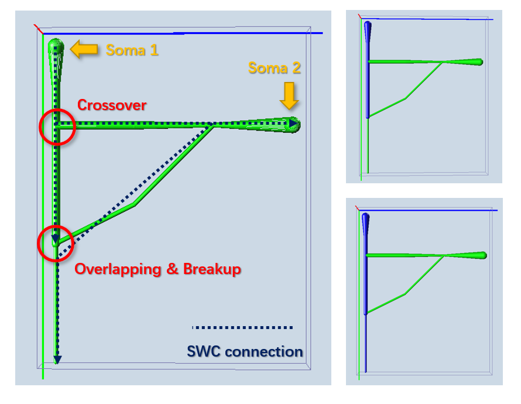

# Ensemble-Cut
Based on G-Cut, I add more metrics, such as for angle and radius.
The graph cut is no long based on topological trees, but a highly
interconnected network.

## Installation

```shell
$ pip install E-Cut
```

## Usage

Construct an `ECut` class object to run the workflow.
```python
from ecut.graph_cut import ECut
from ecut.swc_handler import parse_swc, write_swc

# NOTE: the node numbering of this tree should be SORTED, and starts from ZERO.
tree = parse_swc('filepath.swc')
e = ECut(tree, [0, 100])    # 0 and 100 are the IDs of somata
e.run()
trees = e.export_swc()
write_swc(trees[100], 'outpath_100.swc')
```

You can customize the metrics to modify the optimization parameters.

```python
...

from ecut.graph_metrics import EnsembleMetric

metric = EnsembleMetric(gof_weight=2, angle_weight=0.5)
e = ECut(tree, [0, 100], metric=metric)

...
```
You can even subclass `ECut` and `EnsembleMetric` to create your own optimization workflow or
introduce more metrics into it.

## Comparison with the original G-Cut

E-Cut can segment highly complexed topological structures that can hardly be
handled by G-Cut. In the following case, I construct a pseudo neuron with 2 types
of common topological errors.



In this example, G-Cut is unable to fix the breakup between neurites (a tip node
that is very close to another branch). On the other hand, E-Cut considers all
such cases within a distance threshold by building up a fully interconnected
network of neurites.